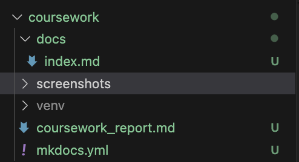
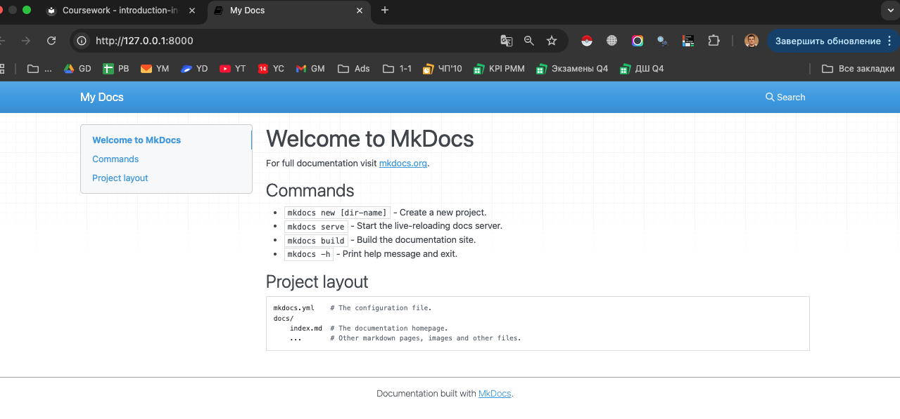
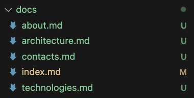
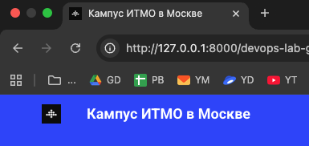
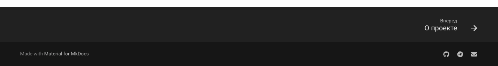
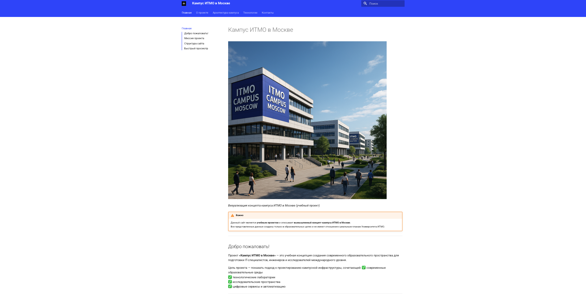
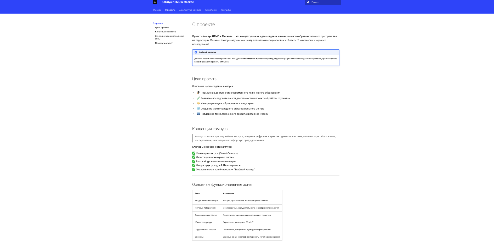
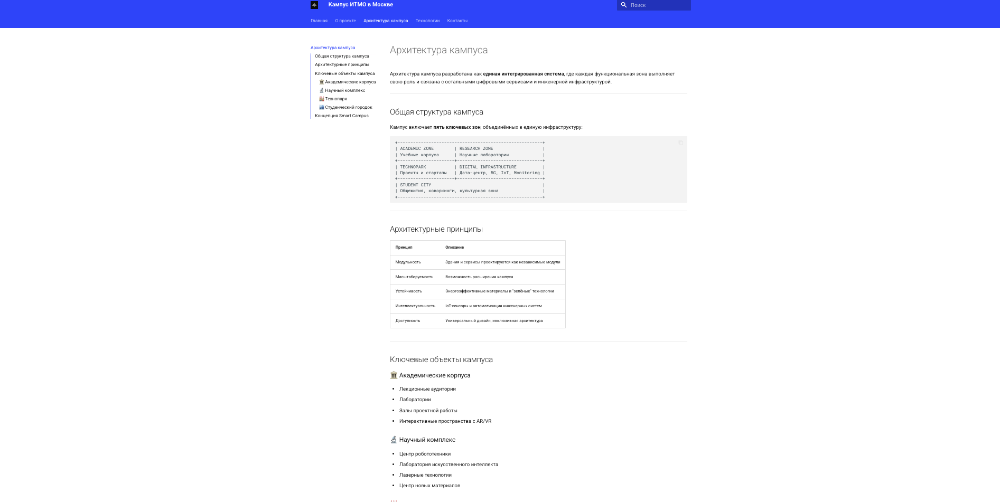
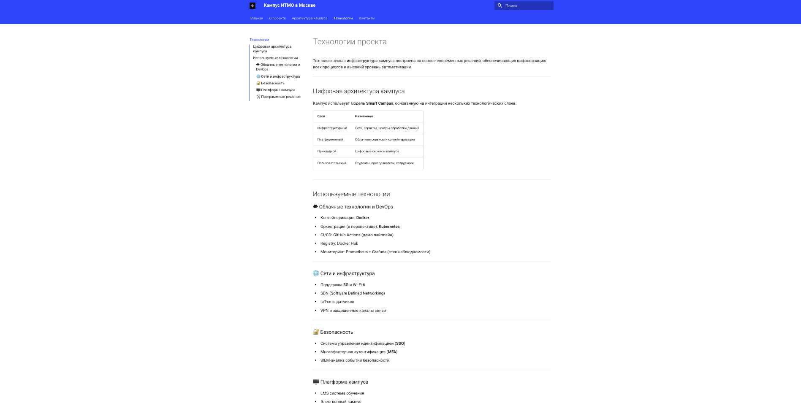

# Курсовая работа
**Тема:** Создание персонального сайта на MkDocs  
**Проект:** Вымышленный проект "Кампус ИТМО в Москве"  
**Автор:** Gunin Nikita Alekseevich  
**Группа:** U4225  
**Курс:** Introduction in Web Technologies  
**Год:** 2025/2026

---

## Введение
Курсовая работа направлена на разработку персонального демонстрационного сайта с использованием технологии **MkDocs** и темы **Material for MkDocs**. Проект реализуется на основе вымышленного концепта кампуса Университета ИТМО в Москве и служит учебным примером построения документированных и структурированных веб-проектов.

---

## Цель работы
Целью данной курсовой работы является разработка статического веб-сайта, включающего информационные разделы, навигацию, брендинг и техническую документацию, а также освоение работы с MkDocs, Git и GitHub.

---

## Этап 1. Подготовка проекта
Для выполнения курсовой работы создана папка проекта `coursework` внутри репозитория. Было настроено виртуальное окружение Python и установлены инструменты **MkDocs** и **Material for MkDocs**.

### Команды настройки
```bash
python3 -m venv venv
source venv/bin/activate
pip install mkdocs mkdocs-material
mkdocs new .
```

### Структура проекта
```
coursework/
├── docs/
│   └── index.md
├── mkdocs.yml
├── venv/
└── coursework_report.md
```

### Скриншоты



---

## Этап 2. Настройка конфигурации MkDocs
Для настройки внешнего вида и структуры сайта был изменён файл `mkdocs.yml`. Добавлена тема **Material**, настроены палитры, язык интерфейса и разделы сайта.

### Пример конфигурации:
```yaml
site_name: Кампус ИТМО в Москве
site_description: Вымышленный учебный проект – демонстрационный сайт
theme:
  name: material
  language: ru
nav:
  - Главная: index.md
  - О проекте: about.md
  - Архитектура кампуса: architecture.md
  - Технологии: technologies.md
  - Контакты: contacts.md
```

---

## Этап 3. Создание контента
Были добавлены и наполнены информационные страницы:

| Страница | Описание |
|----------|-----------|
| index.md | Главная страница с описанием проекта |
| about.md | Информация о проекте |
| architecture.md | Архитектура кампуса |
| technologies.md | Используемые технологии |
| contacts.md | Контактные данные |



---

## Этап 4. Добавление брендинга и логотипа
Для придания сайту идентичности был добавлен логотип и favicon. Создана папка `images`, добавлено изображение кампуса и логотип.

```yaml
theme:
  logo: images/itmo_campus_logo.png
  favicon: images/itmo_campus_logo.png
```



---

## Этап 5. Улучшение интерфейса
На сайте включены удобные функции темы Material:
- Меню навигации
- Верхние вкладки
- Поддержка тёмной темы
- Поиск по сайту
- Подсветка кода

---

## Этап 6. Настройка футера и социальных ссылок
Добавлена информация об авторе и социальные ссылки в нижнюю часть сайта:

```yaml
extra:
  social:
    - icon: fontawesome/brands/github
      link: https://github.com/itmo-campus-moscow
```



---

## Этап 7. Итоговая структура проекта
```
coursework/
├── docs/
│   ├── index.md
│   ├── about.md
│   ├── architecture.md
│   ├── technologies.md
│   ├── contacts.md
│   └── images/
├── mkdocs.yml
└── screenshots/
```

---

## Заключение
В ходе выполнения курсовой работы был разработан демонстрационный веб-сайт на базе генератора документации **MkDocs** с темой **Material**. Проект показал преимущества статической генерации, простоту масштабирования и удобную структуру Markdown-документации.

---

## Приложения
*Скриншоты всех страниц сайта размещены в папке `screenshots`.*





