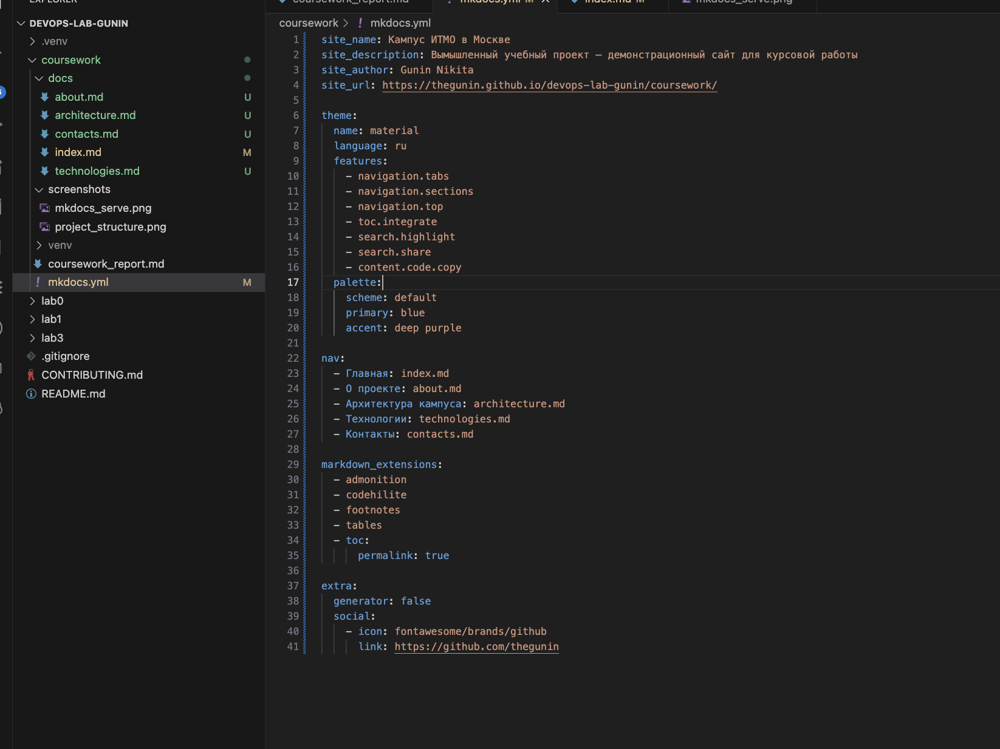

# Курсовая работа
**Тема:** Создание персонального сайта на MkDocs  
**Проект:** Вымышленный проект "Кампус ИТМО в Москве"  
**Автор:** Gunin Nikita Alekseevich  
**Группа:** U4225  
**Курс:** Introduction in Web Technologies  
**Год:** 2025/2026

---

## Этап 1. Подготовка проекта

Для выполнения курсовой работы создана папка проекта `coursework` внутри репозитория.  
Было настроено виртуальное окружение Python и установлены инструменты **MkDocs** и **Material for MkDocs**.

### Команды настройки

```bash
python3 -m venv venv
source venv/bin/activate
pip install mkdocs mkdocs-material
mkdocs new .
```

### Структура проекта

```
coursework/
├── docs/
│   └── index.md
├── mkdocs.yml
├── venv/
└── coursework_report.md
```

### Скриншоты этапа

Структура проекта после инициализации:


Запуск локального сервера MkDocs:


---

## Этап 2. Настройка конфигурации MkDocs

На данном этапе был настроен сайт с использованием темы **Material**.  
Файл `mkdocs.yml` был изменён для настройки внешнего вида и структуры сайта.

### Конфигурационный файл `mkdocs.yml`

```yaml
site_name: Кампус ИТМО в Москве
site_description: Вымышленный учебный проект – демонстрационный сайт для курсовой работы
site_author: Gunin Nikita
site_url: https://thegunin.github.io/devops-lab-gunin/coursework/

theme:
  name: material
  language: ru
  features:
    - navigation.tabs
    - navigation.sections
    - navigation.top
    - toc.integrate
    - search.highlight
    - search.share
    - content.code.copy
  palette:
    scheme: default
    primary: blue
    accent: deep purple

nav:
  - Главная: index.md
  - О проекте: about.md
  - Архитектура кампуса: architecture.md
  - Технологии: technologies.md
  - Контакты: contacts.md

markdown_extensions:
  - admonition
  - codehilite
  - footnotes
  - tables
  - toc:
      permalink: true

extra:
  generator: false
  social:
    - icon: fontawesome/brands/github
      link: https://github.com/thegunin
```

### Скриншоты этапа

Настройка файла `mkdocs.yml`:



Созданные страницы сайта:


---

## Этап 3. Создание контента сайта

На данном этапе была сформирована содержательная часть сайта. Созданы и наполнены основные страницы проекта с использованием технического и инженерного стиля описания.

### Созданные страницы

| Файл | Назначение |
|------|------------|
| `index.md` | Главная страница, вводная информация |
| `about.md` | Описание проекта и его целей |
| `architecture.md` | Архитектурная структура кампуса |
| `technologies.md` | Используемые технологии |
| `contacts.md` | Контактные данные автора |

---

### Пример содержимого `index.md`

```markdown
!!! warning "Важно"
    Данный сайт является **учебным проектом** и описывает **вымышленный концепт кампуса ИТМО в Москве**.
```