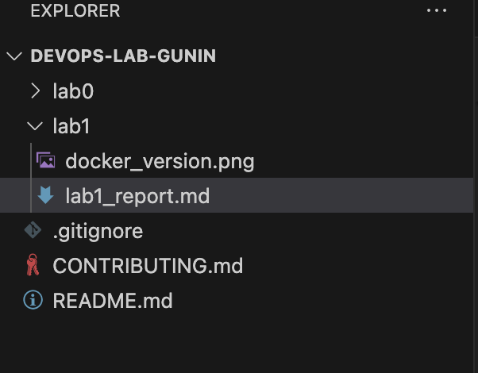
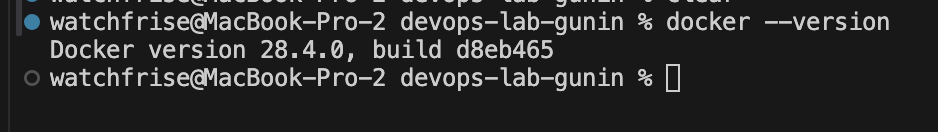

# Отчет по лабораторной №1

University: [ITMO University](https://itmo.ru/ru/)  
Faculty: FTMI  
Course: [introduction-in-web-tech](https://itmo-ict-faculty.github.io/introduction-in-web-tech)  
Year: 2025/2026  
Group: U4225  
Author: Gunin Nikita Alekseevich  
Lab: Lab1  
Date of create: 05.10.2025  
Date of finished:  

Доказательствами выполнения лабораторной работы прошу считать историю изменений этого репозитория.

## Ход работы

### Шаг 1. Подготовка проекта

1. В репозитории `devops-lab-gunin` создана новая папка `lab1` для лабораторной №1.  
2. Внутри создан файл `lab1_report.md` с оформленным титульным блоком и структурой для описания шагов.  
3. Все изменения зафиксированы в системе контроля версий Git и отправлены в GitHub.  
4. Репозиторий синхронизирован с удалённой веткой `main`.

### Шаг 2. Установка Docker и проверка версии
1. Скачан и установлен Docker Desktop для macOS.
2. После запуска иконка 🐳 появилась в строке состояния, что подтверждает успешный запуск демона Docker.
3. Проверка установки командой `docker --version` показала корректный вывод версии.

