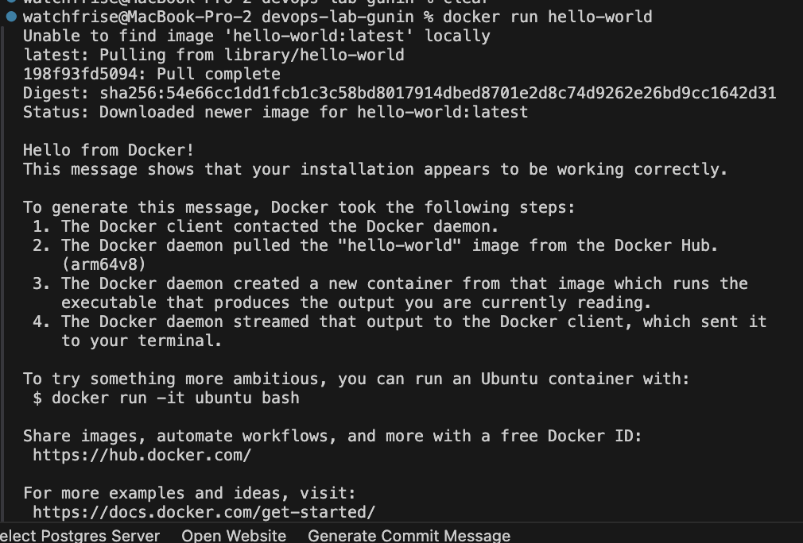
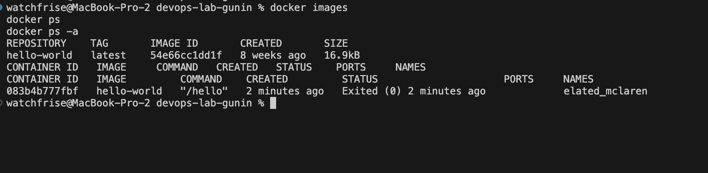
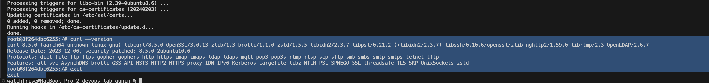
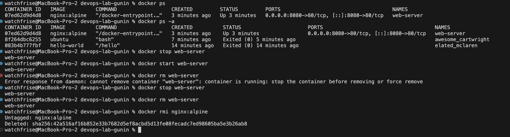
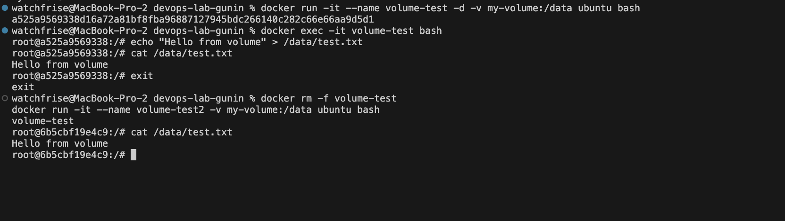
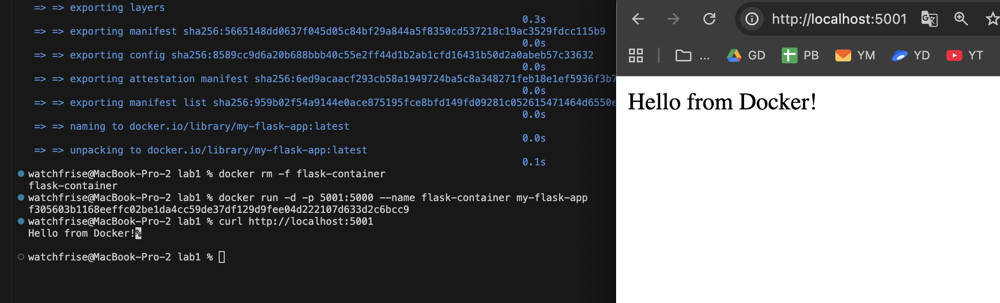

# Отчет по лабораторной №1

University: [ITMO University](https://itmo.ru/ru/)  
Faculty: FTMI  
Course: [introduction-in-web-tech](https://itmo-ict-faculty.github.io/introduction-in-web-tech)  
Year: 2025/2026  
Group: U4225  
Author: Gunin Nikita Alekseevich  
Lab: Lab1  
Date of create: 05.10.2025  
Date of finished:  

Доказательствами выполнения лабораторной работы прошу считать историю изменений этого репозитория.

## Ход работы


### Шаг 1. Подготовка проекта

1. В репозитории `devops-lab-gunin` создана новая папка `lab1` для лабораторной №1.  
2. Внутри создан файл `lab1_report.md` с оформленным титульным блоком и структурой для описания шагов.  
3. Все изменения зафиксированы в системе контроля версий Git и отправлены в GitHub.  
4. Репозиторий синхронизирован с удалённой веткой `main`.


### Шаг 2. Установка Docker и проверка версии
1. Скачан и установлен Docker Desktop для macOS.
2. После запуска иконка 🐳 появилась в строке состояния, что подтверждает успешный запуск демона Docker.
3. Проверка установки командой `docker --version` показала корректный вывод версии.


### Шаг 3. Проверка работы Docker через тестовый контейнер

1. Выполнена команда `docker run hello-world`.  
2. Docker автоматически загрузил образ `hello-world` из Docker Hub и создал контейнер.  
3. Контейнер успешно запустился и вывел сообщение *"Hello from Docker!"*, подтверждающее корректную работу Docker.  




### Шаг 4. Изучение базовых команд Docker

1. Выполнены команды:
   - `docker images` — отображает список загруженных образов.  
   - `docker ps` — показывает только запущенные контейнеры.  
   - `docker ps -a` — показывает все контейнеры, включая завершённые.  
2. В результате видно, что образ `hello-world` успешно скачан и контейнер завершил работу с кодом `0`.




### Шаг 5. Работа с готовыми образами (Ubuntu)

1. Скачан официальный образ Ubuntu командой `docker pull ubuntu:latest`.  
2. Контейнер запущен в интерактивном режиме (`docker run -it ubuntu bash`).  
3. Внутри контейнера выполнена установка пакета `curl` через `apt update && apt install -y curl`.  
4. Проверка `curl --version` подтвердила успешную установку.  




### Шаг 6. Запуск веб-сервера Nginx в контейнере

1. Контейнер Nginx запущен командой:
docker run -d -p 8080:80 –name web-server nginx:alpine

2. Проверка работы в браузере по адресу [http://localhost:8080](http://localhost:8080) показала стандартную страницу “Welcome to nginx!”.  
3. Через команду `docker logs web-server` подтверждено успешное выполнение контейнера.  
4. Подключение к контейнеру выполнено командой `docker exec -it web-server sh`.


### Шаг 7. Управление контейнерами

1. Выполнены команды управления контейнерами:  
   - `docker ps` — просмотр запущенных контейнеров;  
   - `docker ps -a` — просмотр всех контейнеров;  
   - `docker stop web-server` — остановка контейнера;  
   - `docker start web-server` — повторный запуск;  
   - `docker rm web-server` — удаление контейнера;  
   - `docker rmi nginx:alpine` — удаление образа.  
2. Все операции выполнены успешно, контейнеры корректно останавливались и удалялись.



### Шаг 8. Работа с томами (Docker Volumes)

1. Создан том `my-volume` командой `docker volume create my-volume`.  
2. Запущен контейнер с подключённым томом:  
docker run -it –name volume-test -d -v my-volume:/data ubuntu bash
3. Внутри контейнера создан файл `/data/test.txt` со строкой "Hello from volume".  
4. После удаления контейнера и запуска нового с тем же томом файл сохранился, что подтверждает работу томов Docker.  



## Шаг 9. Лабораторная работа со звёздочкой — создание Dockerfile и запуск Flask-приложения

1. Созданы файлы `app.py`, `requirements.txt` и `Dockerfile`:
   - `app.py` содержит минимальное Flask-приложение, возвращающее строку *"Hello from Docker!"*.
   - `requirements.txt` включает необходимые зависимости:
     ```
     Flask==2.0.1
     Werkzeug==2.0.3
     ```
   - `Dockerfile` содержит инструкции для сборки образа на базе `python:3.9-slim` с установкой зависимостей и запуском приложения.
2. Образ собран командой:
docker build -t my-flask-app .
3. Контейнер запущен командой:
docker run -d -p 5001:5000 –name flask-container my-flask-app
4. Проверка работы выполнена командой:
curl http://localhost:5001
Результат — корректный ответ приложения: Hello from Docker! 
5. Flask-приложение успешно работает в контейнере, доступно по адресу [http://localhost:5001](http://localhost:5001).



---

## Результаты лабораторной работы

В ходе выполнения лабораторной работы №1 были изучены основы работы с Docker:

1. Установлен и проверен Docker через запуск тестового контейнера `hello-world`.
2. Освоены базовые команды (`docker ps`, `docker images`, `docker stop`, `docker rm`, `docker rmi`).
3. Выполнен запуск контейнера с образом `Ubuntu` и установка пакета `curl`.
4. Настроен и протестирован контейнер с веб-сервером `nginx`.
5. Освоено управление контейнерами (остановка, удаление, повторный запуск).
6. Изучена работа с томами (volumes) и подтверждено сохранение данных после удаления контейнера.
7. Создан собственный образ на основе `python:3.9-slim`, содержащий Flask-приложение.
8. Образ успешно собран и запущен; приложение доступно по адресу [http://localhost:5001](http://localhost:5001), что подтверждается ответом:


