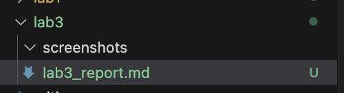
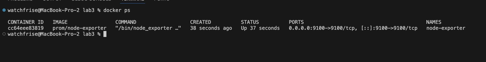
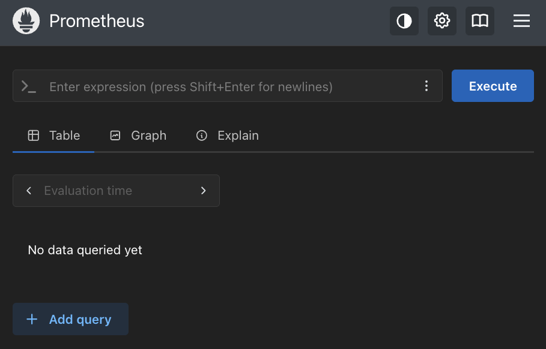
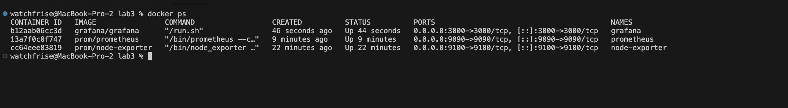
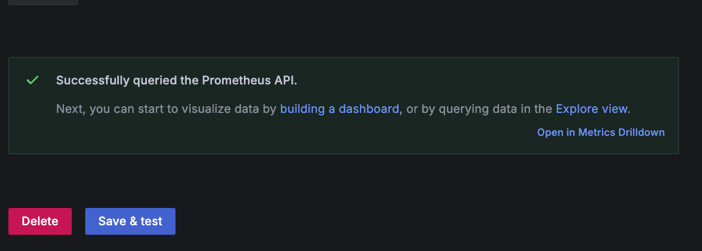
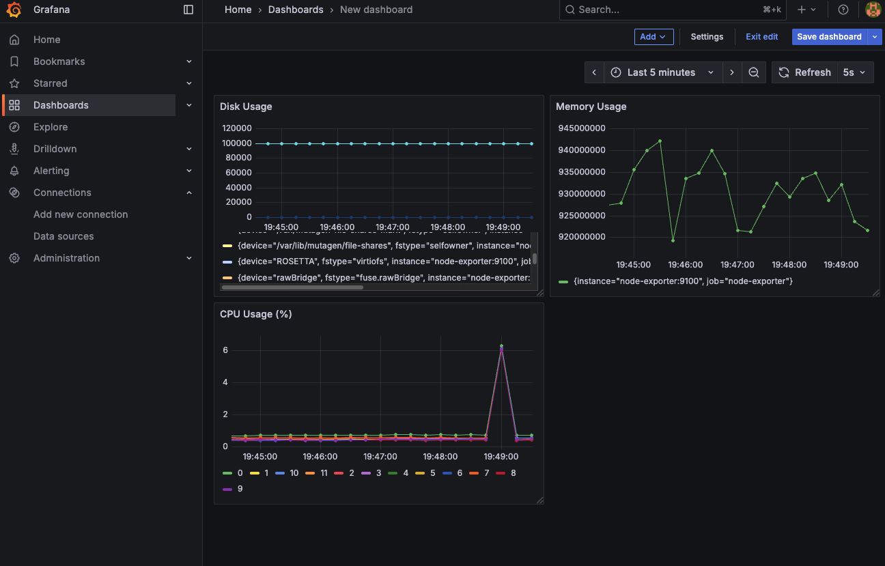

# Отчёт по лабораторной работе №3
**Тема:** Мониторинг с Prometheus и Grafana

**University:** ITMO University  
**Faculty:** FTMI  
**Course:** Introduction in Web Technologies  
**Year:** 2025/2026  
**Group:** U4225  
**Author:** Gunin Nikita Alekseevich  
**Lab:** №3  
**Date of create:** 10.10.2025  
**Date of finish:** 14.10.2025  

---

## Цель работы
Изучить инструменты мониторинга Prometheus и Grafana, настроить сбор и визуализацию системных метрик при помощи Docker-контейнеров.

---

## Шаг 1. Подготовка структуры проекта

Создана папка `lab3` в репозитории с подпапкой `screenshots` для скриншотов и файлом отчёта:

```
devops-lab-gunin/
└── lab3/
    ├── lab3_report.md
    └── screenshots/
```



---

## Шаг 2. Создание конфигурации Prometheus

Создан файл `prometheus/prometheus.yml`:

```yaml
global:
  scrape_interval: 15s

scrape_configs:
  - job_name: 'prometheus'
    static_configs:
      - targets: ['localhost:9090']

  - job_name: 'node-exporter'
    static_configs:
      - targets: ['node-exporter:9100']
```

---

## Шаг 3. Запуск Node Exporter

Node Exporter собирает системные метрики (CPU, память, файловая система). Команда запуска:

```bash
docker run -d \
  --name node-exporter \
  --restart=unless-stopped \
  -p 9100:9100 \
  -v "/proc:/host/proc:ro" \
  -v "/sys:/host/sys:ro" \
  -v "/:/rootfs:ro" \
  prom/node-exporter \
  --path.procfs=/host/proc \
  --path.rootfs=/rootfs \
  --path.sysfs=/host/sys \
  --collector.filesystem.mount-points-exclude="^/(sys|proc|dev|host|etc)($$|/)"
```



---

## Шаг 4. Запуск Prometheus

Создан Docker volume:

```bash
docker volume create prometheus-data
```

Запущен Prometheus:

```bash
docker run -d \
  --name prometheus \
  -p 9090:9090 \
  -v $(pwd)/prometheus:/etc/prometheus \
  prom/prometheus \
  --config.file=/etc/prometheus/prometheus.yml
```

Проверка Web UI Prometheus доступна по адресу `http://localhost:9090`:



---

## Шаг 5. Запуск Grafana

Запущена Grafana в Docker:

```bash
docker volume create grafana-data

docker run -d \
  --name grafana \
  --restart=unless-stopped \
  -p 3000:3000 \
  -v grafana-data:/var/lib/grafana \
  -e "GF_SECURITY_ADMIN_PASSWORD=admin" \
  grafana/grafana
```



---

## Шаг 6. Подключение Prometheus к Grafana

Prometheus подключён как источник данных (Data Source) в Grafana:

- Открыто меню: **Connections → Data Sources → Add new data source**
- Тип: **Prometheus**
- URL:
  ```
  http://host.docker.internal:9090
  ```
- Результат: **Data source is working ✅**



---

## Шаг 7. Создание дашборда в Grafana

Создан дашборд с тремя панелями:

| Метрика | Запрос (PromQL) |
|---------|------------------|
| CPU Usage (%) | `100 - (avg by(instance) (rate(node_cpu_seconds_total{mode="idle"}[5m])) * 100)` |
| Memory Usage | `node_memory_MemTotal_bytes - node_memory_MemAvailable_bytes` |
| Disk Usage (GB) | `(node_filesystem_size_bytes - node_filesystem_free_bytes) / 1024 / 1024 / 1024` |



---

## Вывод

В ходе выполнения работы была развернута система мониторинга на базе **Prometheus** и **Grafana**. Настроен сбор метрик при помощи **Node Exporter**, выполнена контейнеризация с использованием **Docker**, а также построены графики производительности системы (CPU, память, диск).

Практически закреплены навыки DevOps: мониторинг, Docker, визуализация данных.

---

✅ *Доказательства выполнения лабораторной работы представлены скриншотами и историей репозитория GitHub.*